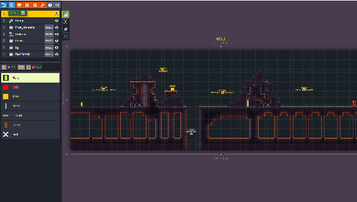

# About

Castle Run is a platformer demo created butchering Fort Loop, the game created by Sebastien Benard (Deepnight) for Ludum Dare 47.
The intent was to understand how LDTK works using **Heaps** framework (https://heaps.io) and **Haxe** language (https://haxe.org).

I'm quite sure this implementation is far from acceptable, but it works and it was fun working on it.

Please check and try the wonderful level editor **LDTK** (https://ldtk.io/) Deepnight is workin on.

# Changes
v0.1
- Increased player velocity
- Added hero lifebar
- Added fallzone (on Trigger for now)
- Added exit stairs
- Added multiple enemy types
- Added hero run animation frames
- Replaced autoattack with manual 
- Removed ammo
- Removed vault system
- Removed time loop
- Removed light/dark system

# Installation & usage

Please refer to **Deepnight's Gamebase guide** (https://deepnight.net/tutorial/using-my-gamebase-to-create-a-heaps-game/) to buold the game.

# Credits

- LDTK https://ldtk.io/
- Slime https://rvros.itch.io/pixel-art-animated-slime
- Fort Loop https://github.com/deepnight/ld47

